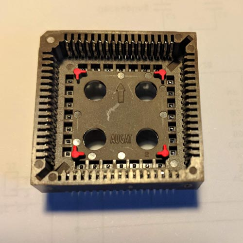
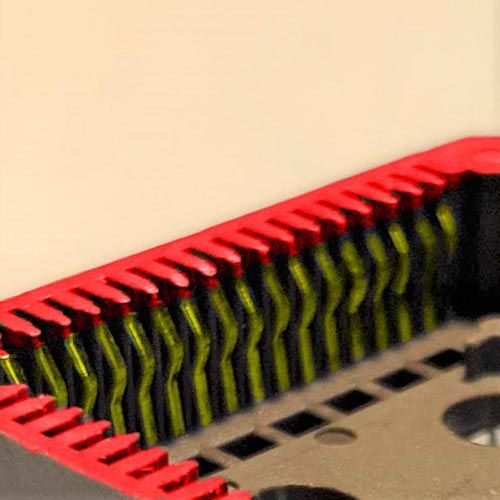
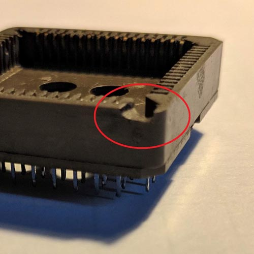

## PLCC Socket Rework Guide

This is a short guide to show how to modify the PLCC socket to make it give a better fit and connection to the on board Amiga 600 CPU.

Please ensure to use a good quality socket with thick strong pins. I personally use Augat PCS-068A, Amphenol or TE Connectivity sockets, some of these are discontinued but can still be found easily online. There are probably other sockets that are equally as good, but I find many generic cheap sockets just pop off of the CPU and give poor connectivity. 

1. Remove any raised parts (highlighted in red) from the inside of the socket, ensuring the inside is totally flat.

2. The surface of the socket (highlighted in red) needs to be removed from the socket. Only a small amount needs removing (0.5 to 1mm) until the surface of the socket is flush and level with the tips on the inner pins (the pins are hightlighted in yellow). You can do this by just rubbing the socket over a sheet of sandpaper, belt/disk sander, CNC machine, or I use a cheap small sanding disk that attaches to a drill. 

3. Remove a small notch from the corner of the socket so that it sits over the resistor which is located near the A600 CPU. 

4. Ensure to clean any remnants and dust from the socket. A small brush and compressed air (if you have it) should get rid of most of it, or run them through an ultrasonic cleaner.

