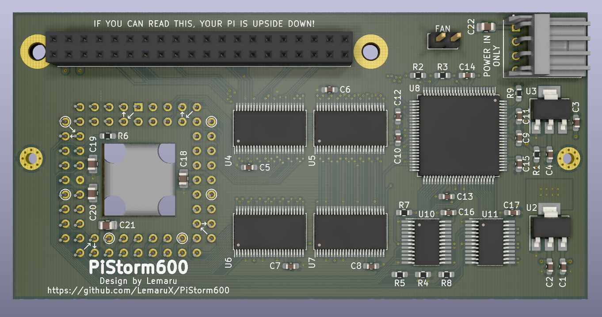
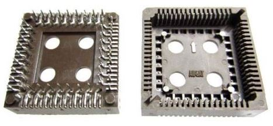

# PiStorm600
This is a Amiga 600 compatible rework of the original PiStorm Rev. B board. It clips over the 68000 CPU of the A600 using an inverted PLCC socket in the same way as many other A600 accelerators. Once fitted it disables the onboard CPU and allows the CPU emulator that is running on the Pi (Mushashi or Emu68) to take over.

Please find details of the original PiStorm project on the main GitHub page. This covers the installation and setup of the original PiStorm board, and all the information found there also applies to this A600 version. You can find the original project here: https://github.com/captain-amygdala/pistorm

There is also a Discord server that is dedicated to the PiStorm project. Here you can get support and discuss development. To join use the invite link: https://discord.gg/Gc36ebUXeM

You can also join the PiStorm Facebook group to chat about all things PiStorm. https://www.facebook.com/groups/pistorm/

---

## Installation
Simply align the PLCC socket over the onboard 68k CPU and press down until it clips fully into place. 

If required there are two mounting holes which can be used to attach it securely to the A600 motherboard using the HDD mounting holes. For this, I recommend using M1.6 x 16mm screws pushed through from underneath the motherboard, nylon spacers (need to be the same height as the PLCC socket, usually around 8mm for a modified Augat/TE/Amphenol socket), and M1.6 nuts. Do not tighten the nuts up too much as this can damage either the adaptor or your motherboard.

When connecting the Pi to the PiStorm, please orient it as pictured below and ensure the GPIO pins are aligned correctly. If the pins are misaligned when power is applied, you risk damaging the GPIO on your Pi. You can use 11mm standoffs to support the Pi if required. 

Currently only the Pi Zero2, Pi 3A+, and Pi 3B+ (with a USB port removed) are supported by the PiStorm, although this may change in future firmware. Personally, I prefer the Pi Zero2 just due to it being a smaller device, which is ideal when space is already limited in the A600. 

Please refer to the original PiStorm GitHub page for details on how to flash the CPLD and setup the Mushashi emulator. In the Wiki section you can also find a pretty comprehensive step by step guide to setup both the emulator and the optional extras such as RTG, PiSCSI storage, and A314 networking. Once the CPLD has been flashed, you are also free to use the Emu68 emulator. 

**REMOVAL** - If you wish to remove the PiStorm board. Do not pull it directly upward as this can damage the original CPU. Instead, just lift the right hand side of the PiStorm board at an angle, which will release it from the 68k CPU. 

---

## PLCC Socket Considerations
To achieve the best fit on the A600 CPU, please use a good quality PLCC socket with strong pins such as the Augat PCS-068A, or some TE Connectivity and Amphenol sockets (these all seem to be discontinued but can still be found online as new old stock). You can identify the higher quality sockets that give a tighter fit and better connection as they have thicker pins and all look similar to the socket pictured below when viewed from underneath. 

As the PLCC socket is being used in a way that it is not intended, please follow the instructions [here](PLCC-Rework.md) to modify the socket. This will allow it to grip the on-board 68k better, resulting in a better connection and preventing it from easily popping off the CPU. 

**NOTE** If you use a cheap generic PLCC socket with thin weak pins, or don't modify it as explained in the PLCC-Rework guide, then it is highly likely you will encounter connection issues resulting in the board not working correctly, or it will not clamp onto the CPU very well and easily become dislodged. 

---

## Power Requirements
If experiencing any undervoltage issues, you can provide additional power to the device (e.g. by connecting it to the Amiga’s floppy power connector using a splitter cable). If you still experience throttling issues, then please measure the 5V rail on your machine whilst under load. The Pi requires 4.75-5.25V to run reliably. If your 5V rail is too low, it is recommended to use a modern PSU such as a Mean Well (PT or RT models have an adjustable 5V rail).

**WARNING!** When applying additional power, please ensure it is taken from the same PSU as the Amiga itself (for example, take the power from the motherboards floppy power connector). **DO NOT** use an external 5V or USB power supply. Also, please ensure the power connections of your cable are correct (or omit the 12V wire entirely), as applying 12V to the wrong pin will fry your board and may damage your Amiga. **DO NOT USE THIS CONNECTOR TO POWER ANY DEVICES, IT IS ONLY FOR APPLYING ADDITIONAL POWER IF REQUIRED!**

If using a Pi Zero2 then it is unlikely you will need to apply additional power. A Pi 3A+ can consume more power, but this is not often an issue until you start connecting USB devices.

---

## Known Issues
There are several issues with the PiStorm when used in the Amiga 600 which are outlined below. If you encounter any further issues that are not mentioned, please post any issues over in the #pistorm600 channel on Discord. You can also report any hardware issues with the PiStorm600 board here. Otherwise if they are emulator related issues please report them on the relevant PiStorm or Emu68 GitHub pages.

- Mushashi - Appears to work when emulator is first loaded, but often shows a corrupt screen, hangs, or gurus after a soft reboot with CTRL+A+A. Once the emulator is restarted it seems fine again until rebooted. Only affects Mushahi, Emu68 appears to work as expected.
**WORKAROUND** - If you wish to use Mushashi, you can resolve these issues by using the PiStormX firmware here https://github.com/LemaruX/PiStorm-Firmware
- Mushashi - MapROM currently does not work so you require a physical ROM to be installed in your machine.
**WORKAROUND** - As above, to resolve Mushashi issues, use the PiStormX firmware here https://github.com/LemaruX/PiStorm-Firmware
- Emu68 - Only currently working with Kickstart 3.1 and 3.2 (either physical or mapped ROMs). **This is resolved in the latest nightly builds**
- PCMCIA Network Cards - Currently some PCMCIA network cards are reported to not be working by some users, but your mileage may vary. Please feel free to report what cards are and are not working over on Discord. This is not such a big issue as A314 networking is a better option to use, and network support will soon be coming to Emu68.

---

## Bill Of Materials

| Ref | Value | Footprint | Notes |
| ----------- | ----------- | ----------- | ----------- |
| C1,C2,C3,C4 | 22uf | 22uf | 0603 | |
| C5,C6,C7,C8,C9,C10,C11,C12,C13,C14,C15,C16,C17 | 100nf | 0603 | |
| C18,C19,C20,C21,C22 | 10uf | 0805 | |
| R1,R5,R9 | 0R | 0603 | |
| R2,R3 | 4.7k | 0603 | |
| R6 | 220R | 0603 | |
| R7 | 1K | 0603 | |
| U2 | LM1117-3.3 | SOT-223 | |
| U4,U5,U6,U7 | SN74LVC16374DGGR | TSSOP-48 | Can use SN74LVC16373 as an alternative |
| U8 | EPM240T100C5N | LQFP-100 | Please see notes below on alternative CPLDs |
| U10,U11 | SN74CBTD3384PWLE |TSSOP-24 | If using the Rev B board then SSOP-24 parts such as SN74CBTD3384DBR can also be used|
| U1 |  | PLCC68 Socket| A good quality socket such as an Augat PCS-068A, TE Connectivity or Amphenol is desirable. For a better fit on the A600 CPU, please modify the socket as per the instructions [here](PLCC-Rework.md) |
| U9 |  | 40-Pin Female Pin Header | |
| J1 |  | 171826-4 | TE Connectivity floppy power header (or compatible connector) **NOTE** use a keyed header and NOT just some standard pin header. Connecting the power incorrectly will damage your PiStorm board and possibly your Amiga |
| J2 |  | Fan Header | **Only on Rev B boards.** Any 2 pin connector can be used (XH2.54 seems to be the common connector on 40mm fans). Only recommend connecting a fan if applying addtional power via J1 |

**Do not populate any parts not listed above, details below** 
- R8 is a placeholder that can be used to passthrough BR if bus arbitration is ever supported by the CPLD.
- R4 is a placeholder for other 68k systems where the system clock is dirty. This is not required on Amigas.
- U3 is only required if using a CPLD that requires 1.8v VCC_INT. See alternative CPLD details below. 

### Alternative CPLDs

| Part Number | Notes | Changes to BOM Above |
| ----------- | ----------- | ----------- |
| EPM240T100C5N | Can also use I5N variant. | No changed from BOM listed above required. |
| EPM570T100C5N | Can also use I5N variant. | No changed from BOM listed above required. |
| EPM240GT100C5N | 1.8v VCC_INT. Can also use I5N variant.  | **DO NOT POPULATE R1. FIT LM1117-1.8 in U3.** |
| EPM570GT100C5N | 1.8v VCC_INT. Can also use I5N variant.  | **DO NOT POPULATE R1. FIT LM1117-1.8 in U3.** |
| 5M240ZT100C5N | **MaxV CPLD - NOT RECOMMENDED TO USE AT PRESENT.** 1.8v VCC_INT. Can also use I5N variant. | **DO NOT POPULATE R1. FIT LM1117-1.8 in U3.** |

**You can also find an interactive BOM located in the BOM folder.**

---

## Revision History

### Revision A
- Original design

### Revision B
- Created a hybrid footprint so that either TSSOP or SSOP SN74CBTD3384's can be used.
- Moved a couple of traces and vias to accomodate new footprint, and tidied up some other traces and vias.
- Added teardrops for pads and vias.
- Added a pin header option for a fan (any 2pin or XH2.54 connector should do). Only recommended to use if applying external power.

---

## Support The Project

If you wish to manufacture some boards and also support this and any future projects at the same time, then you can order professionally made cheap PCBs using my link below:

Alternatively, you can always buy me a coffee on the link below. Any tips are much appreciated. 

---

## Thanks
- [Claude Schwarz](https://github.com/captain-amygdala) for bringing us the PiStorm project, it's given new life to many machines.
- Bnu for all his work on the original PiStorm emulator and all the added extra functionality it brings to our machines. 
- [Michal Schulz](https://github.com/michalsc) for bringing his amazing Emu68 emulator to the PiStorm. 
- All the folks over on Discord PiStorm server and the Facebook group.

